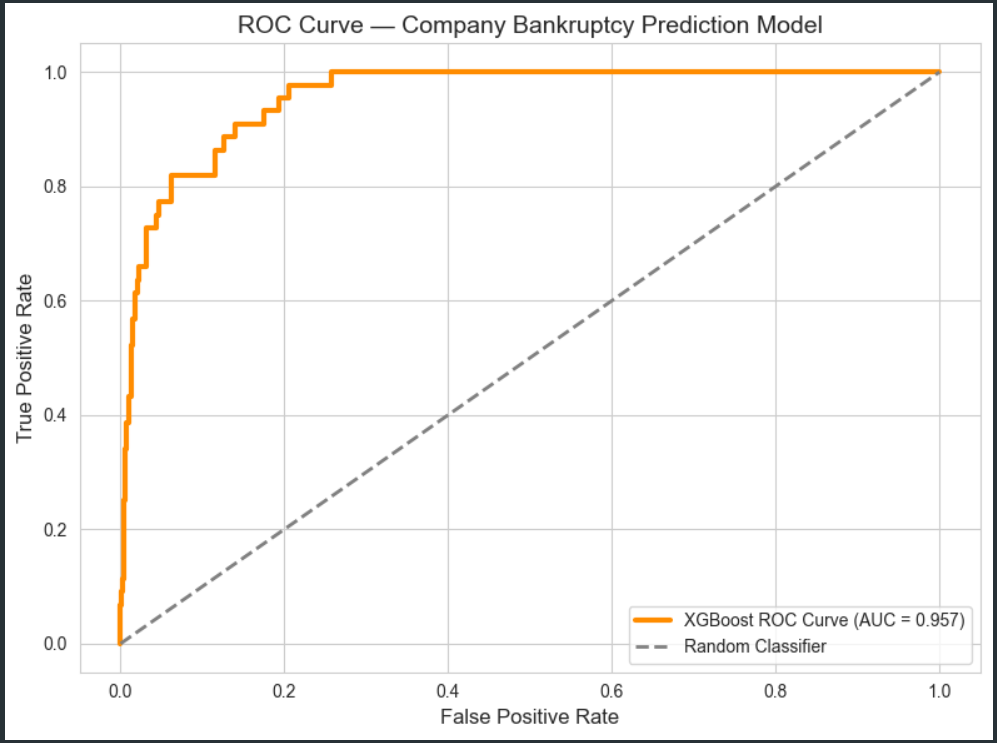
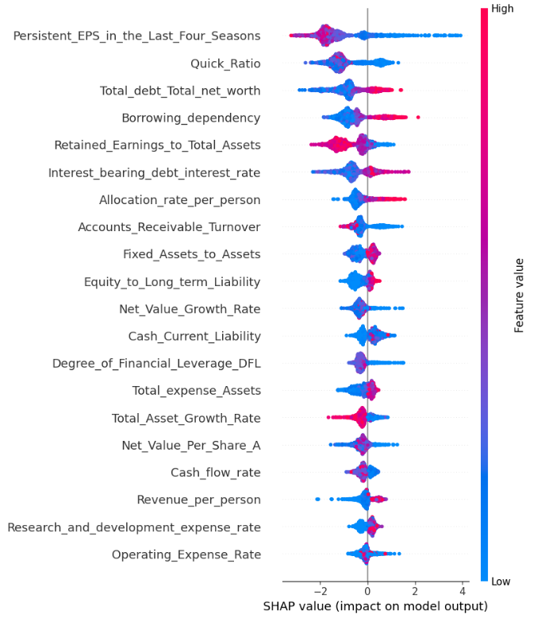
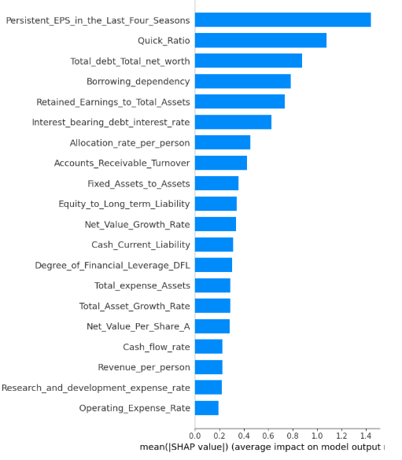
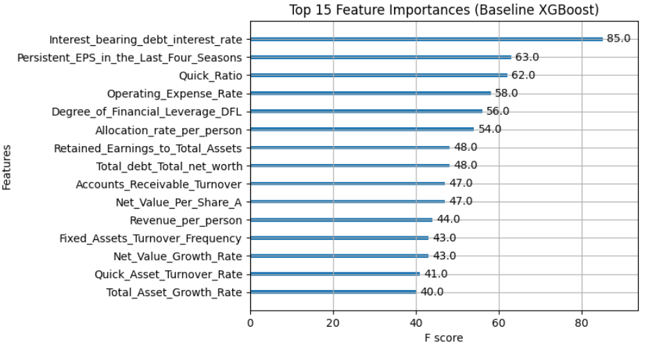
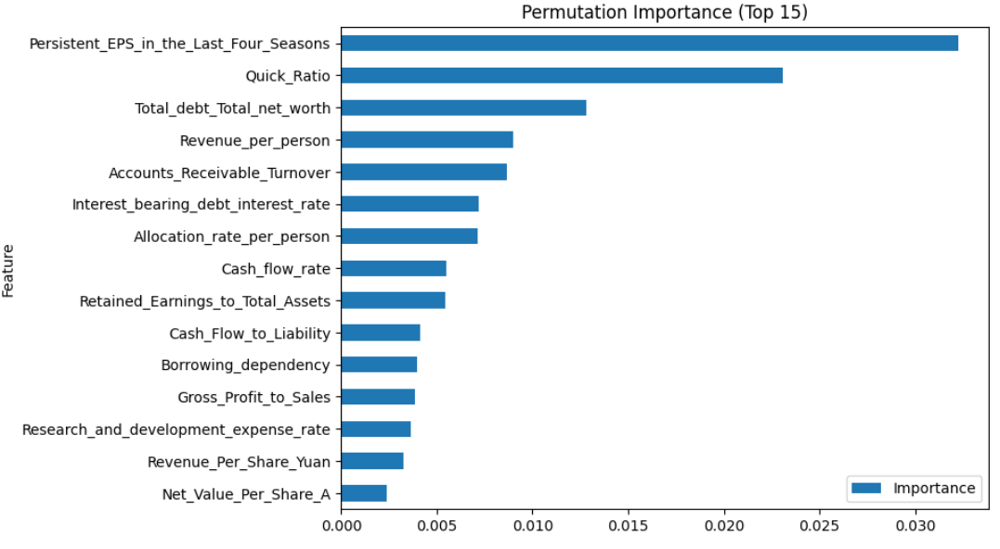
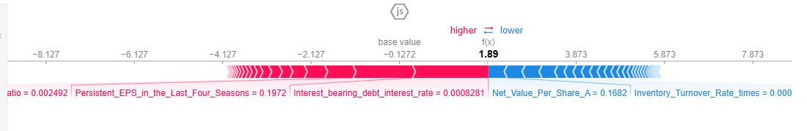

# Company Bankruptcy Prediction

Predicting corporate bankruptcy risk from financial statement ratios using XGBoost, with SHAP-driven explainability and business risk recommendations.

**Author:** Ayush Saxena <br/>
[reignofayush@gmail.com](mailto:reignofayush@gmail.com)

---

## Overview

This project builds a machine learning model to predict whether a company will go bankrupt based on 90+ financial ratios (profitability, liquidity, leverage, turnover, etc.). The core challenge is **severe class imbalance** (only 3.2% of companies in the dataset are bankrupt), which makes this a recall-sensitive problem where the cost of missing a bankrupt company (false negative) is much higher than flagging a healthy one (false positive).

The project covers the full pipeline: statistical validation of the dataset, feature pruning, handling class imbalance (class weighting vs. SMOTE), model comparison (Logistic Regression vs. XGBoost), threshold tuning, and SHAP-based explainability to translate model outputs into actionable business recommendations.

## Dataset

- **6,819 companies × 95 financial ratio features**, binary target (`Bankrupt` / `Not Bankrupt`)
- Class distribution: **96.8% non-bankrupt vs. 3.2% bankrupt** — severe imbalance
- No missing values; features span profitability, liquidity, leverage, turnover, and growth ratios
- Source: dataset provided as part of a placement/selection assessment (Learnbay). **Not included in this repo** — see [Reproducing Results](#reproducing-results) below.

> The original problem statement and presentation deck used for the assessment are also excluded from this repo, as they aren't original analytical work — the notebook and results below represent the actual project.

## Methodology

1. **Statistical validation** — t-tests and Cohen's d effect sizes across all features to confirm signal was real and not noise from a small dataset; distributions cross-checked against financial theory (e.g. profitability and leverage ratios came out as strongest predictors, which lines up with how bankruptcy actually happens).
2. **Feature pruning** — manual removal of redundant/duplicate ratios, correlation-based pruning (>0.95 correlated pairs, keeping the one with higher effect size), and near-zero-variance filtering. Reduced 95 → 57 features.
3. **Train/test split** — 80/20 stratified split (done *before* any scaling/transformation to avoid data leakage).
4. **Imbalance handling** — compared two strategies on Logistic Regression: `class_weight='balanced'` vs. SMOTE oversampling. For XGBoost, used `scale_pos_weight`.
5. **Threshold tuning** — since class imbalance makes the default 0.5 threshold useless, optimal thresholds were found by maximizing F2-score (recall-weighted) via grid search over probability thresholds.
6. **Model explainability** — SHAP (TreeExplainer) + permutation importance + native XGBoost feature importance, cross-checked against each other to confirm the risk drivers were genuine.

## Models Compared

| Model | Threshold | Accuracy | Precision | Recall | F1 | ROC-AUC |
|---|---|---|---|---|---|---|
| Logistic Regression (Class Weight) | 0.50 | 0.878 | 0.178 | **0.773** | 0.289 | 0.891 |
| Logistic Regression (SMOTE) | 0.50 | 0.955 | 0.356 | 0.477 | 0.408 | 0.885 |
| XGBoost (default threshold) | 0.50 | 0.969 | 0.528 | 0.432 | 0.475 | 0.957 |
| XGBoost (tuned hyperparameters, GridSearchCV) | 0.19 | 0.890 | 0.203 | 0.818 | 0.330 | 0.952 |
| **XGBoost Baseline (optimal threshold) — Final Model** | **0.08** | **0.960** | **0.432** | **0.727** | **0.542** | **0.957** |

**Final model: baseline XGBoost with `scale_pos_weight` at an F2-optimized threshold of 0.08.**

This beat both the hyperparameter-tuned XGBoost and both Logistic Regression variants on the recall/precision trade-off that actually matters here — catching 32 of 44 bankrupt companies in the test set (73% recall) while keeping precision high enough (43%) to stay usable, at a strong 0.957 ROC-AUC. Hyperparameter tuning didn't beat the untuned baseline, so simplicity won out.



## Key Risk Drivers (SHAP Analysis)

Using SHAP, permutation importance, and native XGBoost feature importance together (and only trusting features that showed up as top drivers across **all three** methods), four features consistently stood out:

- **Persistent EPS (Last Four Seasons)** — earnings stability over time
- **Quick Ratio** — short-term liquidity
- **Total Debt / Total Net Worth** — leverage relative to equity
- **Interest-Bearing Debt Interest Rate** — cost of debt servicing

The repeated appearance of the same features across three independent importance methods indicates the signal is real, not artifact noise — and all four align with standard corporate finance theory (earnings stability, liquidity, and leverage are classic bankruptcy predictors).






### Case Study: Explaining a True Positive

A SHAP force plot breaking down exactly why the model correctly flagged one bankrupt company — showing which features pushed the prediction toward "high risk" and by how much.



## Business Recommendations

The model outputs a bankruptcy probability per company, which enables risk segmentation rather than a binary flag:

- **High-Risk firms (probability > 0.5):** reduce capital exposure/allocation, increase monitoring frequency to monthly
- **Medium-Risk firms (probability 0.2–0.5):** monitor liquidity and leverage quarterly, run cash flow stress tests
- **Portfolio-level:** embed the probability score directly into investment screening and capital allocation workflows, rather than using bankruptcy prediction as a standalone gate

## Tech Stack

`Python` · `pandas` / `numpy` · `scikit-learn` · `XGBoost` · `imbalanced-learn (SMOTE)` · `SHAP` · `matplotlib` / `seaborn` · `scipy`

## Repository Structure

```
├── Bankruptcy_Prediction_Model.ipynb   # Full analysis, modeling, and SHAP explainability
├── requirements.txt                             # Dependencies
├── images/                                      # Result plots referenced in this README
└── README.md
```

## Reproducing Results

The dataset is not included in this repo. To reproduce results:
1. Obtain a company bankruptcy dataset with the same structure (financial ratio features + binary bankruptcy label) — the original [Taiwan Economic Journal bankruptcy dataset](https://archive.ics.uci.edu/dataset/572/taiwanese+bankruptcy+prediction) on UCI follows the same schema and is a close public equivalent.
2. Place it in the project root and update the `pd.read_csv(...)` path in the notebook.
3. Install dependencies: `pip install -r requirements.txt`
4. Run the notebook top to bottom.

---

*Part of Ayush Saxena's ML/Data Science portfolio — [ayush-saxena.dev](https://ayush-saxena.dev)*
